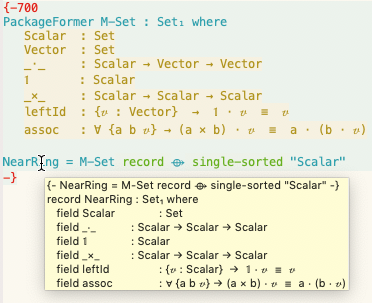

<h1> The Next 700 Module Systems </h1>

<h3> Extending Dependently-Typed Languages to Implement Module System Features In The Core Language </h3>

This repository contains the research proposal for my doctoral studies at McMaster University
under the supervision of Jacques Carette and Wolfram Kahl.

*What are and what should be the module systems of DTLs?*
*DTLs remove distinctions between packaging systems and so*
*using pedestrian modules systems is not necessarily the best route.*

-   A requirements driven approach to coherent modularisarion constructs in Dependently-typed languages.
-   Main Question: *What are the module systems for Dependently-Typed Languages?*
-   Goal: Extend Agda to be powerful enough to implement the module system features, in the core language, that people want to do.

    In user facing libraries, [redundancies are desirable](https://inf.ug.edu.pl/~schwarzw/papers/mkm2010.pdf)
    since they may utilise a a variety of aliases for what user want, this is useful
    flexibility.

    -   However, in the source file, each item should only exist once.
    -   The front-end redundancy should be produced by machine generation,

rather than by hand.

◈ [Website](https://alhassy.github.io/next-700-module-systems-proposal/) ◈

A super simple description of this work, for the layman, can be found [here](https://alhassy.github.io/three_minutes/).

<h2> Prototype and a Preprint </h2>

◈ [Prototype](./prototype/PackageFormer.html)
◈ [A Language Feature to Unbundle Data at Will](./papers/gpce19_a_language_feature_to_unbundle_data_at_will.pdf) ◈

<h2> Proposal </h2>

◈ [PDF](./proposal/thesis-proposal.pdf)
◈ [HTML](./proposal/thesis-proposal.html)
◈ [Slides](./proposal/defence-slides.html)
◈ [`translate` code](./proposal/translate_functions.agda.html)
◈ [`monoid` code](./proposal/monoid_renditions.agda.html)
◆ [Demo](https://www.youtube.com/watch?v=NYOOF9xKBz8&feature=youtu.be)

<h2> Related </h2>

◈ [Metaprogramming Agda --- IFIP Program Generation Talk ](./papers/JC_Program_Generation_Talk_IFIP.pdf)